# Perilif: Period Pain Reliever 🌸

  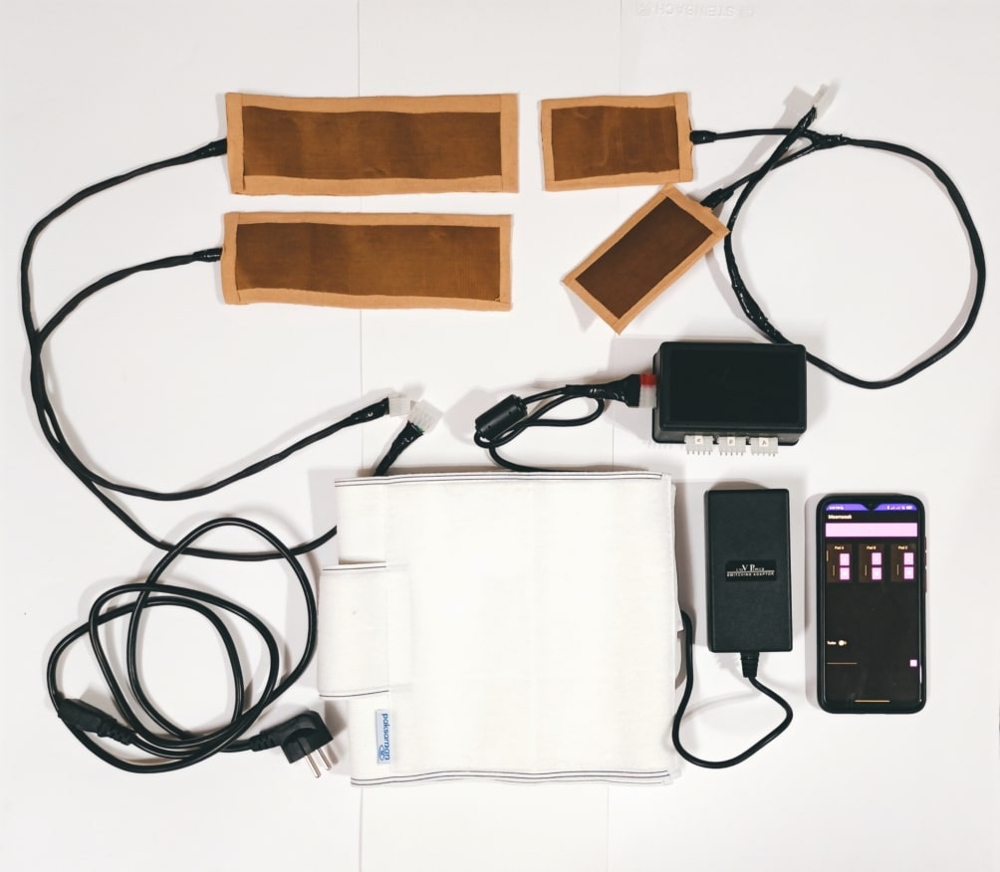

Welcome to Perilif! This is a delightful, heat pad-based buddy designed to soothe menstrual cramps and IBS pain. Built with love on Arduino, it's paired with a cute Android app for easy control.

**Now, a little secret 🤫:** Perilif isn't meant for big-scale, real-life production. Think of it more like a DIY bestie for those curious minds out there. Sure, there are many high-tech gadgets you can buy, but if you fancy crafting something unique for yourself or a loved one, this is a fabulous place to start. 

## Stack 🛠️
Dive into the stack behind Perilif:

### Software

- **Kotlin** 📱:
  We've whipped up a nifty Android app using Kotlin. Connect and control your Perilif right from your phone, all thanks to the Bluetooth protocol.

  You can control each of the pads individually or turn the Turbo feature on to maximize the heat for a short period of time.

  The source code is available in [android-app (kotlin)](android-app (kotlin)) directory.

  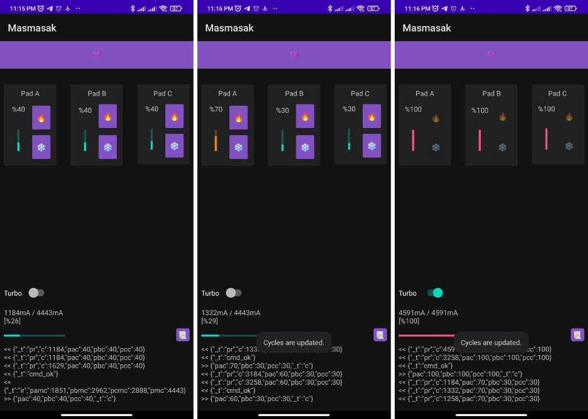

### Hardware
#### Components 🤖
- **Arduino Nano:**

  Using the nimble Arduino Nano, it’s the brain of our little device. It chirps via Bluetooth, keeps an eye on things, and makes sure the heat pads are just the right kind of cozy. PWM signals are the way it controls the heat level.

  The C++ source-code of the Arduino project is avaialble in [arduino-hardware (cpp)](arduino-hardware (cpp)) directory which can be opened inside Arduino IDE.

  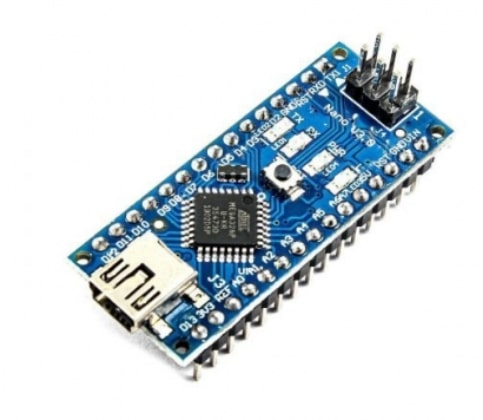

- **HC-05 Bluetooth Module:**

  A HC-05 Bluetooth module (with the helper board) is used for communicating with the Android app.

  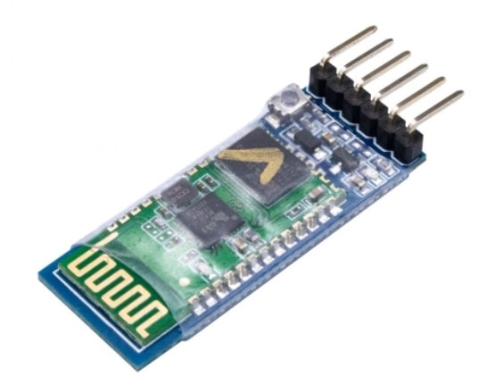

- **Current Sensor:**

  A current sensor (ACS712) is used to gather initial power-source data and colibrate the application using that.

  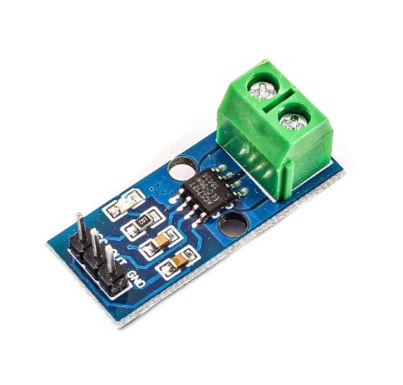

- **Power Supply (Adapter):**
  
  We used a reliable power supply that powers the device with 5V DC and 6A (max). 6A is required since we used 3 pads with 2A consuption.

  Since the device is not efficient with managing PWM signal, it can draw the total amount of current required by the heating pads. So with the current inefficient implementation, you need a reliable power suply.

  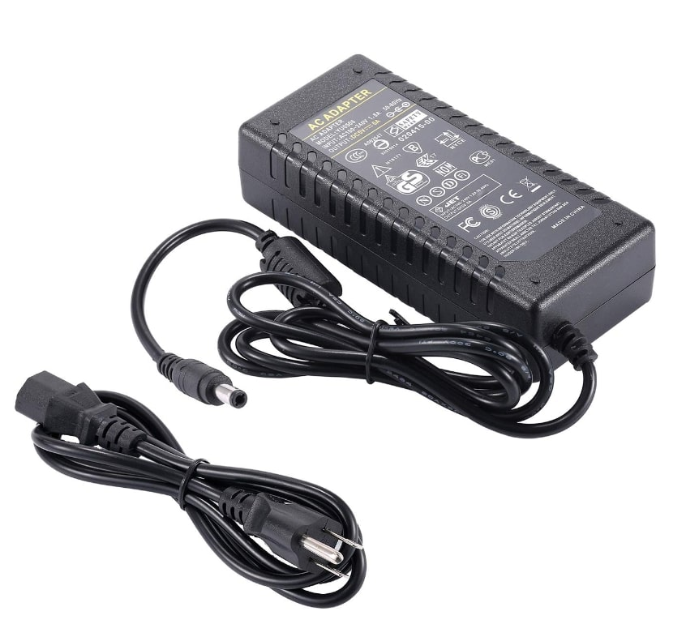

- **MOSEFTS:**

  For amplification, three MOSEFTs (IRF3710) are responisble to control the current-consumption of the heating-pads by opening or closing their gate according to the received PWM signal.

  

    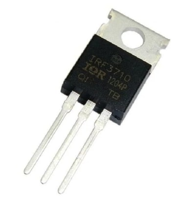
  

- **Heating Pads:**

  3 heating pads are used with the specification of 3.7-5V operation range and 2A current consumption for each.
  
  

    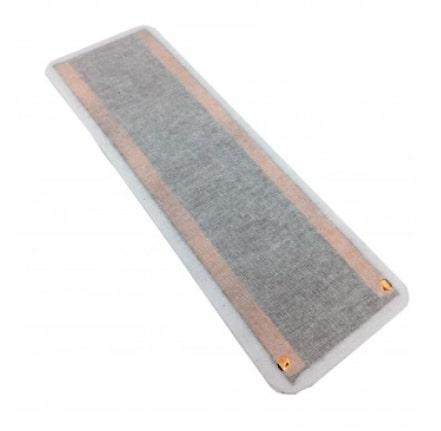
  

  
  The heating pads are wrapped inside a fireproof fiber to reduce the contactable heat, then wrapped inside a bunch of Kinesio Elastic Therapeuit tapes to make them flexible and less annoying.

  

    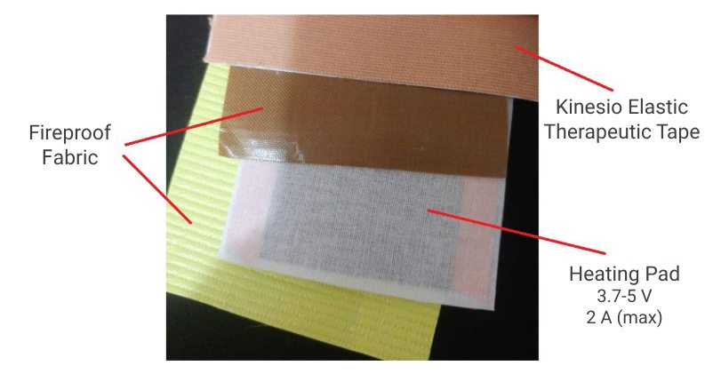
  

- **Case:**
  A combination of MOSEFTs are also responsible to amplify the PWM signals produced by the microcontroller to the heating pads.

  Here is an inner view of the plastic case:

  

    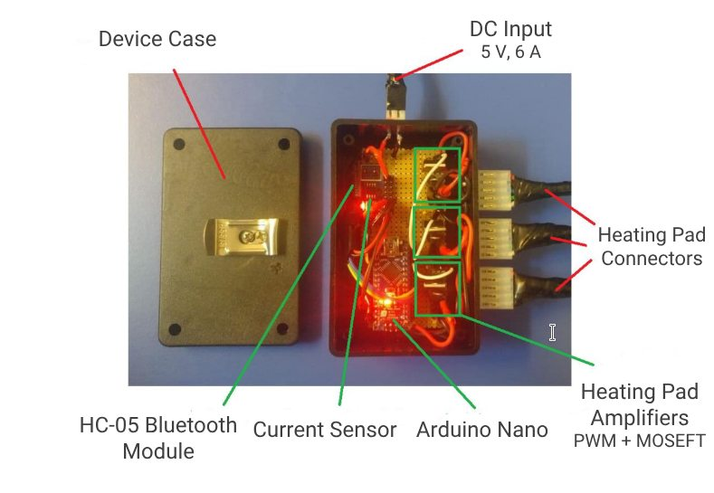
  

- **Back Brace:**

  A comfort back brace to keep the heating pads at the place you need.

  

    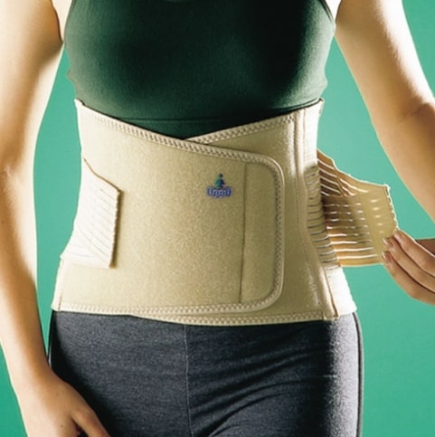
  

- **Wires, connectors, and soldering:**

  Heating pads require high amount of current which require proper and standard wires. Make sure that your wires are able to pass the required current without warming up (they do! so double check the specifications).

  Same as the wires, all of your connectors must be able to pass the current too.

  If you're soldering on board, make sure the parts that are responsible to pass high current are wide enough.

- **Other:**

  Just like any other projects, we need a bunch of resistors (as described in the schematic), wire protectors, tapes, board, soldering iron, etc.

#### Schematic 🔧
  All those wires and thingamajigs? We've sketched them out using [Fritzing](https://fritzing.org/) (an open-source hardware initiative software). It's like a digital canvas, simple and fun to play around with.

  Fritzing source file is available at [schematic (fritzing)](schematic (fritzing)) directory. Here is the shcematic. Note that those  indicate the heating pads.

  

## Important Note and Known Issues
If you're going to build the device, use it or contribute to improve it, consider the following notes very carefully:

### Bluetooth communication is not stable
Sometimes, you need to restart device and/or the application to make the bluetooth communication possible. 

### Device must not be exposed to body
Altough the device is supplied with 5v (which is considered low), it can be still considered as not safe and must NOT be exposed to body. Be very careful when building the device to make it less probable to make raw contact with the body.

Take not that the heatpads, tapes, fireproof fibers, casing, wiring, and other components used in this project must not be considered as waterproof and must not be exposed directly to body.

Direct contact with body will lead to small shock. For non-dry skin or open wounds, it's considered dangerous.

### Take care of fire hazard
Most parts of the device is potential for getting extremely warm. The heat pads, device case, components and the board inside, all of the wires, and the power supply can get heated very quickly.

Other than the PWM signals, NO mechanism is implemented to make the device safe especially from warming up. If something get hot, disconnect the device - wires are very potential.

### PWM signals are not implemented efficiently
Arduino uses PWM signals to order either the heating pads should be off or not. In a control cycle, it may order all of the gates to open which will lead to high pressure on the power source.

In very rare cases it's needed to use all the power provided by the power source, but with the current design, is does happen a lot of times.

This way of implemetation puts more unnecesery presure on the power source with may lead to noise generation and reduction of the power-supply life.

### Amplifiers are not implemented efficiently
There are very considerable amount of energy wasted inside the device (in MOSEFTs), instead of efficiently using it.

 This implementation leads to more-than-needed energy consumption to heat up the pads, heating the case and inner components and reduction of the device life.

Thanks for stopping by! Happy crafting and stay comfy! 😊❤️
